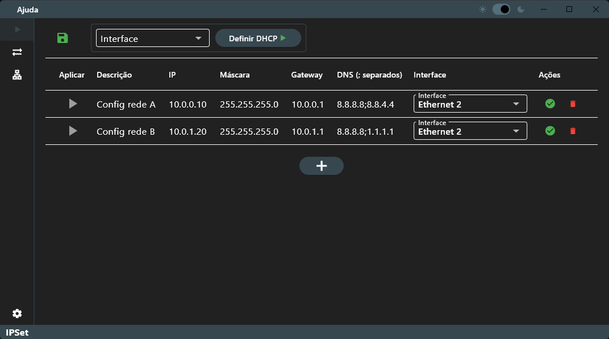

# IPSet

Um aplicativo para alterar IPs V4 de rede no Windows!




## Projeto, download e build

Instalar:
 * Ambiente para flutter com dependencias para build de apps windows!
 * Enigma Virtual Box (opcional)

``` bash
flutter pub get

flutter build windows
```

Obs.: O "build exe.bat" executa o build e usa o "Enigma Virtual Box" para gerar um arquivo .exe único